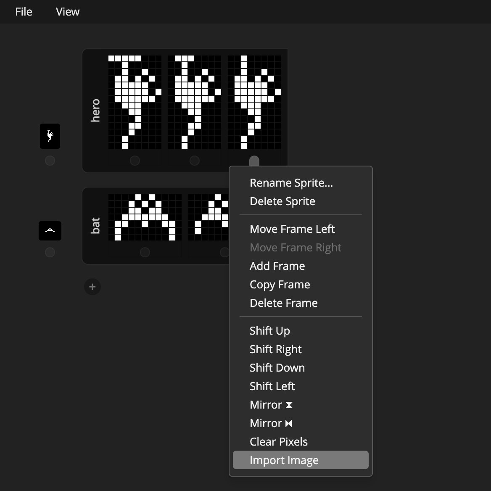

# XBM Editor

## Features
* Any number of sprites
* Any number of frames for each sprites for states / animations
* Save & load projects and export to c++ header file
* Shift, mirror pixels
* Import image

## Preview (Chrome Only)
[Open in browser](https://andremichelle.github.io/xbm-editor/)

## Example Header
    #define hero_width 8
    #define hero_height 14
    static unsigned char hero_xbm[3][14] PROGMEM = {
        {
            0x1F,0x04,0x24,0x56,0x3E,0xBE,0x7E,0x1C,
            0x18,0x10,0x18,0x08,0x04,0x04
        },
        {
            0x0E,0x04,0x24,0x56,0x3E,0xBE,0x7E,0x1C,
            0x18,0x10,0x18,0x08,0x04,0x04
        },
        {
            0x04,0x04,0x24,0x56,0x3E,0xBE,0x7E,0x1C,
            0x18,0x10,0x18,0x08,0x04,0x04
        }
    };

    #define bat_width 11
    #define bat_height 7
    static unsigned char bat_xbm[3][14] PROGMEM = {
        {
            0x50,0x00,0xA8,0x00,0xD8,0x00,0xFC,0x01,
            0x26,0x03,0x02,0x02,0x02,0x02
        },
        {
            0x50,0x00,0xA8,0x00,0xD8,0x00,0xFC,0x01,
            0x22,0x02,0x02,0x02,0x00,0x00
        },
        {
            0x50,0x00,0xA8,0x00,0xD8,0x00,0xFC,0x01,
            0x03,0x06,0x00,0x00,0x00,0x00
        }
    };

    #define tiles_width 8
    #define tiles_height 8
    static unsigned char tiles_xbm[] PROGMEM = {
        0xAE,0x78,0x83,0xEA,0x28,0x7B,0xAB,0xC2
    };

    #define bomb_width 8
    #define bomb_height 8
    static unsigned char bomb_xbm[2][8] PROGMEM = {
        {
            0x00,0x20,0x10,0x20,0x38,0x28,0x38,0x38
        },
        {
            0x00,0x08,0x10,0x08,0x38,0x28,0x38,0x38
        }
    };

## Links
[xbm on wikipedia](https://en.wikipedia.org/wiki/X_BitMap)

## BUILD
Make sure to have sass installed and run in the console:

    sass sass/main.sass:bin/main.css --watch

Make sure to have typescript installed and run in the console:

    tsc -p ./typescript/tsconfig.json --watch
